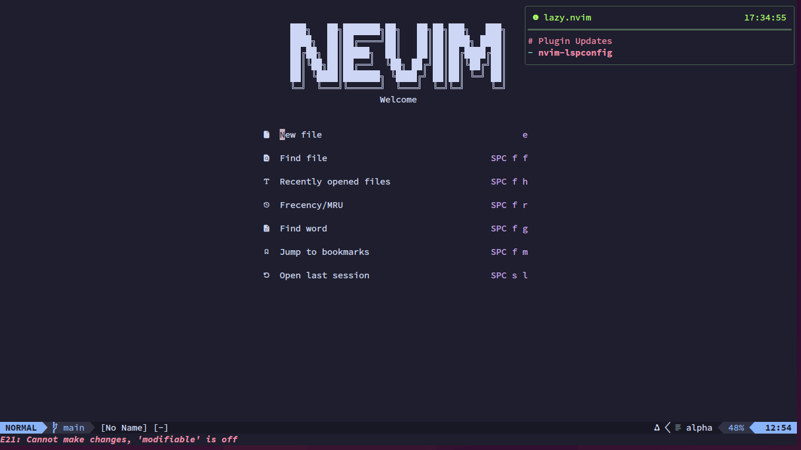
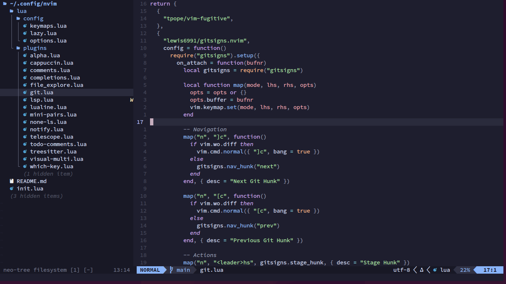
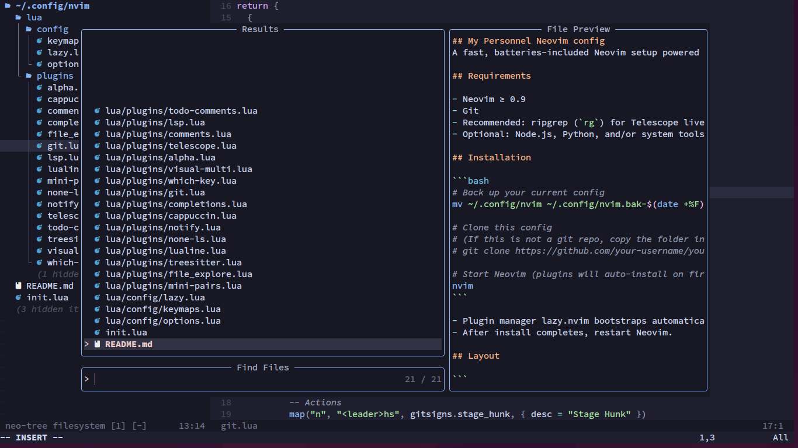
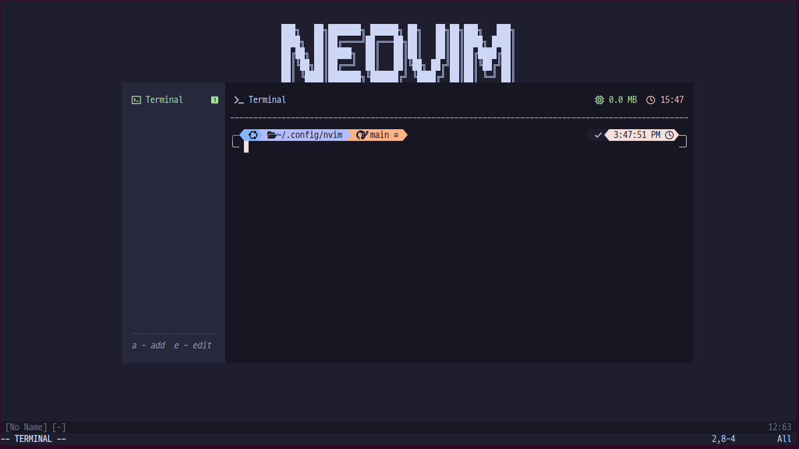

## My Personnel Neovim config
A fast, batteries-included Neovim setup powered by lazy.nvim. It ships with LSP, Treesitter, Telescope, Git integration, statusline, notifications, a start screen, and sensible defaults.

## Requirements

- Neovim ≥ 0.9
- Git
- Recommended: ripgrep (`rg`) for Telescope live grep
- Optional: Node.js, Python, and/or system tools your languages require

## Screenshots

<p align="center">
  
  
  
  
</p>

## Installation

```bash
# Back up your current config
mv ~/.config/nvim ~/.config/nvim.bak-$(date +%F)

# Clone this config
git clone https://github.com/your-username/your-nvim-config ~/.config/nvim

# Start Neovim (plugins will auto-install on first launch)
nvim
```

- Plugin manager lazy.nvim bootstraps automatically on first run (no manual steps needed).
- After install completes, restart Neovim.

## Layout

```
~/.config/nvim
├─ init.lua
├─ lua/
│  ├─ config/
│  │  ├─ options.lua        # Core editor options
│  │  ├─ lazy.lua           # lazy.nvim bootstrap & setup
│  │  └─ keymaps.lua        # Centralized custom key mappings
│  └─ plugins/              # Plugin specs (lazy.nvim)
```

## Included plugins (highlights)

- UI: `catppuccin/nvim` (colorscheme), `nvim-lualine/lualine.nvim`, `rcarriga/nvim-notify`, `goolord/alpha-nvim`, `folke/which-key.nvim`
- Editing: `echasnovski/mini.pairs`, `folke/ts-comments.nvim`, `mg979/vim-visual-multi`
- Navigation/Search: `nvim-telescope/telescope.nvim` (+ ui-select), `nvim-neo-tree/neo-tree.nvim` (+ window-picker)
- Treesitter: `nvim-treesitter/nvim-treesitter`
- LSP: `mason.nvim`, `mason-lspconfig.nvim`, `neovim/nvim-lspconfig`, `j-hui/fidget.nvim`
- Git: `tpope/vim-fugitive`, `lewis6991/gitsigns.nvim`
- Formatting/Linting: `nvimtools/none-ls.nvim` (+ `mason-null-ls.nvim`)

## LSP servers ensured

Via `mason-lspconfig` ensure_installed:
- lua_ls, pyright, ts_ls, ruff, html, cssls

Open Mason UI with:
```vim
:Mason
```

## Formatters/linters (none-ls)

- Formatters: black, isort, stylua, prettierd
- Diagnostics: stylelint
- Auto-install for supported tools is enabled via mason-null-ls

## Key mappings (essentials)

- Leader is space: `<Space>`
- Custom mappings live in `lua/config/keymaps.lua`.

- Telescope
  - `<leader>ff`: Find files
  - `<leader>fg`: Live grep
  - `<leader>fb`: Buffers
  - `<leader>fh`: Help tags

- File explorer (Neo-tree)
  - `<C-\>`: Toggle file explorer
  - `<leader>w`: Pick window

- LSP
  - `gd/gD/gi/gr`: Go to definition/declaration/implementation/references
  - `K`: Hover
  - `<leader>rn`: Rename
  - `<leader>ca`: Code action
  - `<leader>dp` / `<leader>dn`: Prev/Next diagnostic
  - `<leader>F`: Format buffer

- Completion (nvim-cmp)
  - `<C-b>/<C-f>`: Scroll docs
  - `<C-Space>`: Trigger completion
  - `<C-e>`: Abort
  - `<CR>`: Confirm selection

- Git (gitsigns)
  - `]c` / `[c`: Next/Prev hunk
  - `<leader>hs` / `<leader>hr`: Stage/Reset hunk
  - `<leader>hS` / `<leader>hR`: Stage/Reset buffer
  - `<leader>hp`: Preview hunk
  - `<leader>hi`: Preview hunk inline
  - `<leader>hb`: Blame line (full)
  - `<leader>hd` / `<leader>hD`: Diff this / diff against HEAD~
  - `<leader>hQ` / `<leader>hq`: QF list (all/buffer)
  - `<leader>tb`: Toggle line blame
  - `<leader>tw`: Toggle word diff

- Terminal (floaterm)
  - `<leader>t`: Toggle the terminal window

## Editor options (notable)

- Tabs (no expand): `tabstop=2`, `shiftwidth=2`, `expandtab=false`
- Numbers: `number` and `relativenumber`
- UI: `cursorline`, `nowrap`

## Commands you’ll use

- Plugin UI: `:Lazy`
- LSP info: `:LspInfo`
- Mason UI: `:Mason`
- Treesitter update: `:TSUpdate`

## Troubleshooting

- First launch installs plugins. If something fails, run `:Lazy sync` then restart.
- Ensure `rg` is installed for live grep: `sudo apt install ripgrep` (Debian/Ubuntu) or your OS equivalent.
- For language tools (formatters/linters), open `:Mason` to install missing binaries.
- Check health: `:checkhealth`

## Customization

- Change options in `lua/config/options.lua`.
- Add or remove plugins by editing files in `lua/plugins/` or adding new ones.
- Colorscheme is set in `lua/plugins/cappuccin.lua` (change or disable as desired).

## Credits

Built with lazy.nvim and an excellent Neovim plugin ecosystem.
